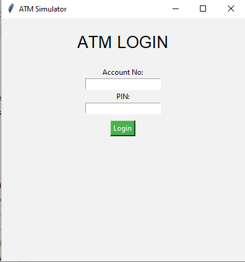

```
💳 ATM SIMULATOR - PYTHON CONSOLE PROJECT

A simple, beginner-friendly ATM Simulator built using Python. This project simulates essential ATM operations like balance inquiry, cash withdrawal, deposit, and PIN verification — all through a clean and interactive console interface.

🛠 FEATURES:
- 🔐 Secure PIN-based authentication
- 💵 Withdraw, deposit, and balance check options
- 🔁 Looping menu until exit
- ❌ Graceful exit with confirmation
- ⚠️ Input validation and error handling
- 🐍 Built with pure Python — no external libraries needed

▶️ HOW TO RUN:
> python atm.py


## 📁 Project Files Description

| File Name     | Description                                                                 |
|---------------|-----------------------------------------------------------------------------|
| `atm.py`      | Main Python script that runs the GUI-based ATM simulator.                  |
| `atm.ico`     | Custom icon used in the application window and executable.                  |
| `setup.py`    | Script to create a Windows installer (MSI) using `py setup.py bdist_msi`.   |


🔧 TO CREATE EXECUTABLE (EXE):
> pyinstaller --onefile atm.py

## 📸 Screenshot




📁 FILES:
- atm.py → Main Python Script
- atm.exe → Standalone Executable (Optional)
- README.md → Project Documentation

📜 LICENSE:
MIT License – Free to use, modify, and distribute.

🌟 Like this project? Show some love by giving it a ⭐ on GitHub!
```
